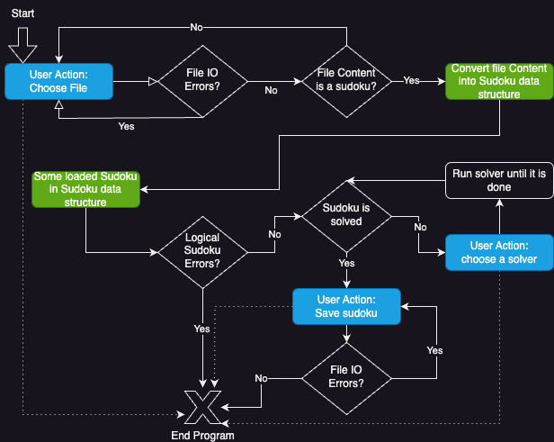

# kp-project
This repository presents a comparison of the languages Scala 3 and Go, focusing on their functional programming capabilities.\
It includes a Sudoku solver for puzzles of any size (n x n), though the emphasis is not on implementing the most efficient solver.

## Sudoku Rules

### Syntax
These are the syntax rules the program checks:

- A sudoku has always as many rows as it has columns. (`n x n` for `n > 0`)
- Each cell of a sudoku is separated to the next cell with at least one space "` `".
- Each row of the sudoku is separated to the next row with exactly one line break `\n`. (Trailing spaces are allowed)
- Allowed strings for a given cell are either any numbers from `{1, ... n}` or `_` for empty cells. They can be surrounded by any amount of spaces

### Semantics
Following the [standard, commonly known Sudoku rules](https://en.wikipedia.org/wiki/Sudoku#Variations_of_grid_sizes_or_region_shapes), but extending them from `n=9` to any `n`:

- If the sudoku has a dimension $n$ with $a^2 \times a^2 = n$, then the **rows**, **columns** and **blocks** are not allowed to have duplicate elements.
- Otherwise, **only** **rows** and **columns** of the sudoku are not allowed to have duplicate cells.

**Rows**:\
The rows of a sudoku are n Lists of n cells each and represent the rows of the sudoku grid.

**Columns**:\
The columns of a sudoku are n Lists of n cells each and represent the columns of the sudoku grid.

**Blocks**:\
The blocks of a sudoku (in this project) can only be retrieved from it if the sudoku has the dimension $n$ with $a^2 \times a^2 = n$.
In this case the blocks are n distinct areas of `a x a` sub-grids which can be seen as a list of n cells.

A list has duplicate elements if one or more cells are **equal**.

Two cells are **equal**, if they contain the same number (spaces are ignored here).\
Examples:
- "1" $=$ " 1"
- "1" $\ne$ "2"

### Example Sudokus

```sudoku
_ _
_ 2

(a 2x2 sudoku)
```

```sudoku
1 _ _ _
_ 2 _ 4
_ _ 3 _
2 _ _ 1

(a 4x4 sudoku)
```

## Scala
This project is written in Scala 3 using Functional Programming (FP), with key parts also implemented in Go for comparison (also using FP, see [here](#golang)).\
The best way to understand the code is to read it and try it out! The tests should be very informative, too.

All code regarding sudoku is in `src/main/scala/sudoku`, the workflow is in `src/main/scala/Main/main`.
The tests are inside the `src/test` directory.


### Set up your environment

Download and install Scala from the official page: https://www.scala-lang.org/download/
This project is using Scala `3.3.1` and Scalatest version `3.2.17` as described in build.sbt.

You need to install [sbt](https://www.scala-sbt.org/): `brew install sbt`
I recommend using IntelliJ IDEA to open the scala project.

To run the code, use `sbt run`. To execute all tests, use `sbt test`.

## Structure of the Program
The intended structure of the program is the following workflow:

1. The user types in a filename that contains a sudoku
2. The program loads the sudoku and converts it into an internal data-structure (`Vector[Vector[Option[Int]]]` in Scala, `[][]Cell` in Go)
3. Then the goal is to solve the sudoku
4. If it has errors or is solved, the sudoku can be saved and the program exits
5. If the sudoku is yet to be solved, the user can choose a solution strategy until there is a solution
6. Then we jump to Step 4.

**This is the flow graph for this workflow:**



When saving a sudoku, it gets linted: This means spaces can be added between the cells to make sure they align nicely. This makes a `n x n` sudoku readable, for n > 9, too.

## Golang

The most important parts of the Scala 3 code have also been implemented in Golang (Go). This allows for a comparison of the functional programming capabilities of Scala 3 and Go.\
The best way to understand the code is to read it and try it out! The tests should be very informative, too.

The Go program is not interactive like scala, so I recommend to take an ever closer look at the code and tests instead. 

All code regarding sudoku is in `go/sudoku`, the workflow is in `go/cmd` and there is a `go/util` package with a few Higher-Order Functions.

### Setup your environment
Follow the [official instructions](https://go.dev/doc/tutorial/getting-started) to set up a go environment, and you should be good to "go" (e.g. execute code, run tests, debug).

All go code is inside `./go`. To continue in the console, please run `cd go`.

I recommend to use Goland from IntelliJ. If you don't want that, you can run the tests using `go test ./sudoku` or start the main with `go run ./cmd`.

## Sources
Backtracking Sudoku inspiration:
- https://phabe.ch/2021/02/05/a-sudoku-solver-in-a-few-lines-of-code-or-the-power-of-recursive-programming/
- https://stackoverflow.com/questions/71236966/sudoku-solver-using-recursion-and-backtracking